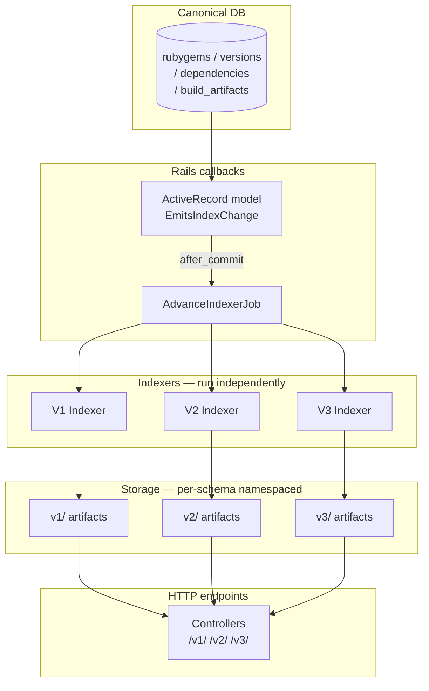
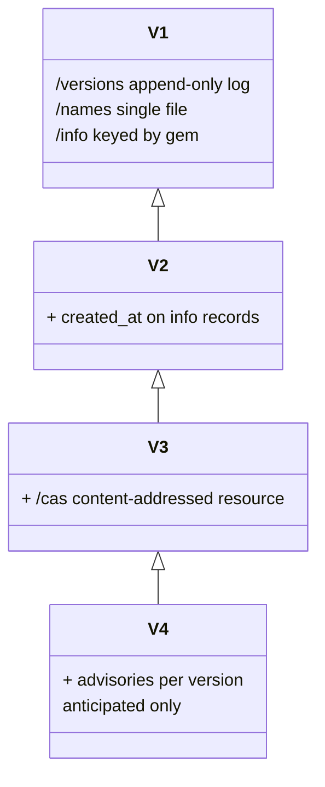
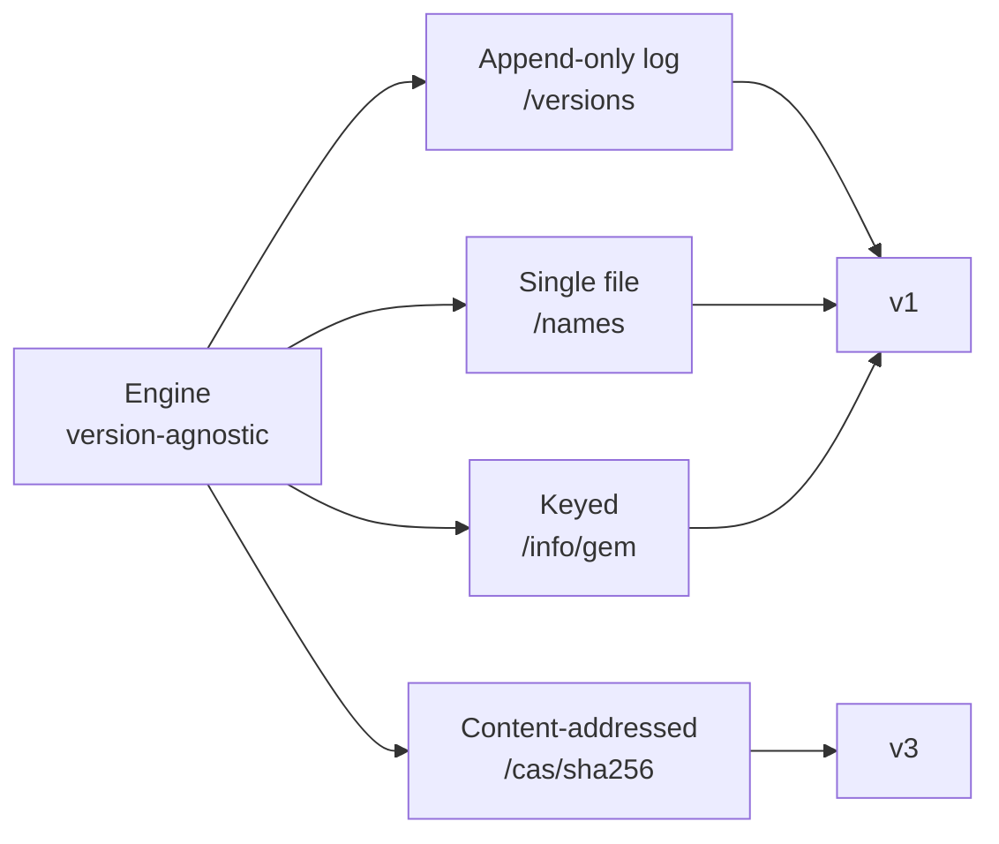

# compact-index-next

Adding a new compact-index version is one schema file. That is the architecture's central claim, and this prototype is a runnable proof of it.

The compact index is the machine-readable format rubygems.org serves to Bundler. Supporting multiple simultaneous versions of it, without the indexers coupling to one another, is the problem this addresses.

## Architecture

The canonical DB (`rubygems` / `versions` / `dependencies` / `build_artifacts`) is the source of truth. The compact index is treated as a CQRS read model materialised from the canonical DB. Each compact-index version (v1, v2, v3, ...) is a sibling **indexer** that owns its own storage and cursor and operates independently of the others. The engine layer (`lib/compact_index/`) is version-agnostic; it knows a small taxonomy of **resource types** (append-only log, single file, keyed, content-addressed). Each compact-index version is one **schema file** (`lib/compact_index/schemas/vN.rb`) that picks resources from the taxonomy and declares the records they contain.

The engine only changes when a structurally new kind of resource is needed. v3 added the content-addressed resource type once; v4 reuses it.

### System overview



### Schema inheritance

Each version inherits from its parent and overrides only what changes. The engine and sibling schemas are untouched.



### Resource type taxonomy

The engine knows four resource types. New schemas pick from this menu; new resource types are added to the engine once, then available to every subsequent schema.



## Pattern names

If you want to look this up in the literature:

- **CQRS read-model materialisation** (Greg Young): without event sourcing. Writes use the canonical Rails model; reads are projected onto separately-maintained per-version artifacts.
- **Materialised View pattern** (Microsoft Cloud Design Patterns).
- **Strategy / schema-driven serialisation**: the engine is the shared codec; each schema is the per-version strategy plugged into it.
- Same shape as industrial search-indexing systems (Elasticsearch, Algolia) use for blue/green index migrations.

## Running it

```sh
bin/rails db:setup            # creates DB, runs migrations, runs seeds
bin/rake compact_index:backfill[all]   # builds every schema's artifacts
bin/rails server
```

Then:

```sh
curl localhost:3000/v1/versions      # current rubygems.org format
curl localhost:3000/v2/versions      # same shape (v2's delta is on /info)
curl localhost:3000/v1/info/rails    # current /info format
curl localhost:3000/v2/info/rails    # adds created_at per version
curl localhost:3000/v3/info/rails    # v3 inherits v2's format
curl localhost:3000/v3/cas/<sha256>  # v3-only: native gem CAS manifest
curl localhost:3000/admin/indexers   # cursor + lag per schema
```

## Operational surface

- `bin/rake compact_index:backfill[v2]`: full rebuild of one schema. Disaster-recovery and new-schema-bootstrap use the same primitive. Sibling schemas are untouched.
- `bin/rake compact_index:backfill[all]`: rebuild every schema.
- `bin/rake compact_index:pause[v2]`: stop the v2 indexer. v1 and v3 keep advancing. Useful for safely rolling back a botched format change.
- `bin/rake compact_index:resume[v2]`: re-enable.
- `bin/rake compact_index:status`: print cursor and lag for every schema.
- `GET /admin/indexers`: same data as JSON.

## How a new compact-index version is added

Adding v4 (or v5, or vN) is localised. Concretely:

1. **Add a schema file at `lib/compact_index/schemas/v4.rb`** that inherits the appropriate parent (probably `V3`) and overrides only what differs. For example, v4 (security warnings) might be:

   ```ruby
   module CompactIndex::Schemas
     class V4 < V3
       name "v4"

       def self.info_requirements(version)
         reqs = super
         advisories = Advisory.affecting(version)
         reqs[:advisories] = advisories.map(&:cve_id).join(";") if advisories.any?
         reqs
       end
     end
   end
   ```

2. **Register it** by adding one line to `CompactIndex.schemas` in `lib/compact_index.rb`.

3. **Migration** for any new canonical-DB tables the schema needs to query (e.g. `advisories`). The schema's source projection is the only place that touches the new table.

4. **Backfill it**: `bin/rake compact_index:backfill[v4]`.

5. **Add a controller route** — only if v4 introduces a brand-new *resource type* (not just new fields). For additive-field versions, the existing controllers serve `/v4/versions`, `/v4/names`, `/v4/info/<gem>` automatically because routes are namespaced by schema name.

That is the full diff for an additive version. The engine, the existing schemas, and the existing controllers are not touched.

When a version needs a structurally new **resource type** (the way v3 needed CAS), add the type at `lib/compact_index/resources/<type>.rb`, extend the schema base class with hooks for it, and add a controller that calls `render_resource(:<resource_name>, key: ...)`. That happens once per new resource type. Every subsequent version that wants the same kind of resource just declares it.

## Project layout

```
lib/compact_index/
  engine.rb                # wire-syntax helpers (delimiters, line layout)
  schema.rb                # base class for per-version schemas
  storage.rb               # per-schema namespaced filesystem storage
  indexer.rb               # generic indexer parameterised by a schema
  resources/
    append_only_log.rb     # /versions-style
    single_file.rb         # /names-style
    keyed.rb               # /info/<gem>-style
    content_addressed.rb   # /cas/<sha256>-style (v3+)
  schemas/
    v1.rb                  # current rubygems.org format
    v2.rb                  # v1 + created_at on /info records
    v3.rb                  # v2 + CAS resource for native gem manifests

app/models/concerns/emits_index_change.rb   # AR after_commit -> jobs
app/jobs/compact_index/advance_indexer_job.rb
app/jobs/compact_index/backfill_job.rb
app/controllers/compact_index/{versions,names,info,cas,base}_controller.rb
app/controllers/admin/indexers_controller.rb
```

## Tests

```sh
$ rails test
```

